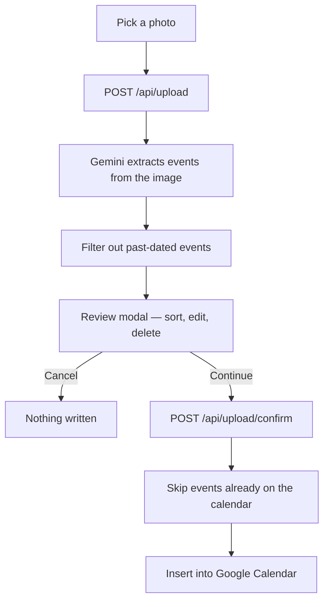

# Calendar Scheduler

Turn a photo of your work schedule into real Google Calendar events.

Upload a screenshot of a shift schedule, syllabus, or itinerary. A vision model reads
the dates and times out of the image, you review and correct anything it got wrong, and
the confirmed events are written to your Google Calendar.

Built for the case that makes this genuinely annoying to do by hand: **shared schedules**
where your shifts are mixed in with your coworkers', and where you might work twice in
one day.

---

## How it works

The upload pipeline is deliberately split into two steps so that **nothing is ever
written to your calendar without your explicit confirmation.**



`/api/upload` only *parses* — it returns the extracted events and touches nothing.
`/api/upload/confirm` is the only route that writes, and it only ever receives the list
the user actually approved.

### Reading shared schedules

Multi-person schedules are the hard case: a grid of colored cells where each person is a
2–3 letter code, and one person can have two separate shifts in a day.

Two things address this:

- **The extraction prompt** describes several schedule layouts explicitly — personal
  weekly tables, time-row × day-column grids, and multi-week images — including the rule
  that a contiguous run of cells is one shift and that two separate runs in a day are two
  shifts, not one merged block.
- **An optional context hint.** Toggle "Shared schedule?" and describe how to find
  yourself (`"BE"`, `"Alex, blue column"`). That string is injected into the prompt to
  filter down to your shifts only. It's opt-in and off by default.

Vision models still misread dense screenshots, which is exactly why the review step
exists and can't be skipped.

---

## Tech stack

| Layer | Choice |
|---|---|
| Framework | Next.js 16 (App Router), React 19, TypeScript |
| Auth | Auth.js v5 (`next-auth`) with the Google provider |
| Database | PostgreSQL via Prisma 7 |
| Vision | Google Gemini (`gemini-3.6-flash`) |
| Calendar | Google Calendar API (`googleapis`) |
| Styling | CSS Modules + design tokens in `globals.css` |
| Hosting | Vercel |

---

## Project structure

```
app/
├── api/
│   ├── auth/[...nextauth]/route.ts   Auth.js route handlers
│   ├── calendar/route.ts             GET upcoming events (widget)
│   └── upload/
│       ├── route.ts                  POST image  → parsed events (no writes)
│       └── confirm/route.ts          POST events → Google Calendar
├── privacy/ · terms/                 Required for OAuth verification
├── layout.tsx · page.tsx             Sign-in and signed-in screens
├── globals.css                       Design tokens, base styles, keyframes
└── *.module.css                      Per-page styles

components/
├── Dropzone.tsx                      Photo staging, upload, shared-schedule toggle
├── ConfirmImportModal.tsx            Review / edit / delete before writing
├── CalendarWidget.tsx                Live "Your calendar" upcoming events
├── SessionProviderWrapper.tsx        Client-side session context
├── icons.tsx                         All inline SVGs
└── *.module.css                      Per-component styles

lib/
├── visionService.ts                  Gemini prompt + image → ParsedEvent[]
├── calendarService.ts                OAuth client, insert, dedupe, list
├── eventTime.ts                      Time parsing, formatting, sorting
└── prisma.ts                         Prisma singleton

prisma/
├── schema.prisma                     Auth.js models (User, Account, Session)
└── migrations/
```

Styling is split out of the components: each one imports a sibling `.module.css`, and all
colors, shadows, and fonts come from tokens defined once in `app/globals.css`.

---

## Getting started

### Prerequisites

- Node.js 20+ (developed on 22)
- A PostgreSQL database
- A Google Cloud project with the Calendar API enabled
- A Gemini API key

### 1. Install

```bash
npm install
```

### 2. Configure Google Cloud

In the [Google Cloud Console](https://console.cloud.google.com/):

1. Enable the **Google Calendar API**.
2. Create an **OAuth 2.0 Client ID** (Web application).
3. Add an authorized redirect URI:
   - Local: `http://localhost:3000/api/auth/callback/google`
   - Production: `https://<your-domain>/api/auth/callback/google`
4. On the OAuth consent screen, add the scope
   `https://www.googleapis.com/auth/calendar.events`.
5. While unverified, add your own account under **Audience → Test users**.

### 3. Environment variables

Create `.env.local`:

```bash
# Google OAuth (Cloud Console → Credentials)
GOOGLE_CLIENT_ID=
GOOGLE_CLIENT_SECRET=

# Auth.js session secret — generate with: npx auth secret
AUTH_SECRET=

# PostgreSQL connection string
DATABASE_URL=

# Google AI Studio → API keys
GEMINI_API_KEY=
```

### 4. Set up the database

```bash
npx prisma migrate dev
```

Prisma reads `.env.local` through `prisma7.config.ts`.

### 5. Run

```bash
npm run dev
```

Open [http://localhost:3000](http://localhost:3000).

---

## Scripts

| Command | Description |
|---|---|
| `npm run dev` | Start the dev server |
| `npm run build` | Production build |
| `npm start` | Serve the production build |
| `npm run lint` | ESLint |

---

## Implementation notes

**Refresh tokens.** The Google provider requests `access_type: "offline"` and
`prompt: "consent"` so Google issues a refresh token. Tokens live in the Prisma `Account`
table; when Google returns a rotated access token mid-request, `calendarService` writes it
back so the next call doesn't trigger an avoidable refresh.

**Duplicate protection.** Every inserted event is tagged with the private extended
property `source=screenshot-scheduler`. Before inserting, the service queries that
event's exact time window for existing tagged events and skips it if one is found — so
re-uploading the same screenshot won't double-book you. The check is scoped per event, so
two different shifts on the same day are unaffected.

**Past events are dropped.** Only future-dated events are inserted, on both the parse and
confirm paths.

---

## Known limitations

- **Timezone is hardcoded** to `America/Los_Angeles` in `lib/calendarService.ts`. Events
  are created in that zone regardless of where the user is.
- **The year is inferred** as the current calendar year. Schedules spanning a New Year
  boundary will land on the wrong year.
- **Extraction accuracy varies** with image quality. Dense, low-resolution, or
  re-compressed screenshots (a screenshot of a screenshot) are the hardest cases. The
  review step is the safety net.
- **OAuth verification.** `calendar.events` is a sensitive scope, so Google requires app
  verification before the app can be used outside its test-user list.
